# L1130-Blue: Silent Trinity Hunt!


![Lab Contents][LabContents]
<!-- Start Document Outline -->

* [Kibana and Initial Hunt](#kibana-and-initial-hunt)
	* [Login to Member Server (WS01)](#login-to-member-server-ws01)
	* [Access Kibana on the (H)ELK SIEM](#access-kibana-on-the-helk-siem)
	* [Initial Search: msbuild](#initial-search-msbuild)
* [ElastAlert](#elastalert)
	* [Login to Member Server (WS01)](#login-to-member-server-ws01-1)
	* [Access Kibana on the (H)ELK SIEM](#access-kibana-on-the-helk-siem-1)
	* [ElastAlert](#elastalert-1)
* [Sysmon Stack](#sysmon-stack)
	* [Login to Member Server (WS01)](#login-to-member-server-ws01-2)
	* [Access Kibana on the (H)ELK SIEM](#access-kibana-on-the-helk-siem-2)
	* [Sysmon Log Index](#sysmon-log-index)
* [Off-Roading with C2 Frameworks](#off-roading-with-c2-frameworks)
	* [Windows Events.](#windows-events)
	* [Sysmon Logs](#sysmon-logs)
	* [Text Search MSBuild](#text-search-msbuild)
	* [Beacon Timing](#beacon-timing)
	* [More Safari](#more-safari)
	* [Mitre ATT&amp;CK Technique Mapping](#mitre-attck-technique-mapping)
	* [ElastAlert Index](#elastalert-index)
* [Shutdown Malware Stagers](#shutdown-malware-stagers)
	* [PowerShell Stager](#powershell-stager)
	* [XML Stager](#xml-stager)
	* [Putty Sessions](#putty-sessions)
	* [Reboot MemberServer WS01](#reboot-memberserver-ws01)

<!-- End Document Outline -->
![][Div1]

![Lab Overview][LabOverview]

Complementing L1130-Red, in this Lab we will be hunting for the trail of IoCs that were the result of malware execution on the Member Server. 

![][Div2]

![Lab Overview][LabObjectives]

* Hunt for Silent Trinity artifacts in Helk
* Utilize ElastAlerts Helk Augmenting.
* Review Sysmons Optics Malware Pathology

![][Div2]

![Lab Overview][LabMethodology]

Connect to the Helk service.  Begin hunting for evidence of a compromise.  Review opportunities to use ElastAlert in the hunt.  Review Sysmons optics stack that resulted from the compromise.

![][Div1]

![Hunt Step One][HuntStepOne]  
## Kibana and Initial Hunt
Lets kickoff the hunt!  Login to the WS01 system and access Kibana.
![][Div2]

### Login to Member Server (WS01)
Connect via Remote Desktop to the Member Server (WS01).  
* See Lab [L0200][L0200] for connection instructions.

![][Div2]

### Access Kibana on the (H)ELK SIEM
Using Chrome or Internet Explorer on Member Server, access the Kibana URI and login using the credentials below.
```plaintext
URL: https://10.10.98.20
Useranme: helk
Password: hunting
```

![][Div2]
### Initial Search: msbuild

Investigate the Kibana dashboard for activity. Use the search term msbuild as seen below.  If you're not sure which index to start with, choose logs-*

![Hunt Search Term][HuntSearchTerm]
```plaintext
msbuild
```

Given enough processing time, Elastic should produce a result like the following (note the 30 second refresh timer). Over a 30-minute period, the malware beaconed approximately once every six (6) seconds. 

| 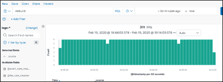 |
|----------|

Event logs may appear as follows:

| 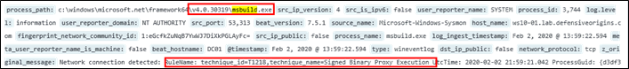 |
|----------|

Having identified the msbuild IoC, continue to the next step of the lab.


![][NextStep]

![][Div1]

![Hunt Step Two][HuntStepTwo]
## ElastAlert
Continue the hunt!

![][Div2]

### Login to Member Server (WS01)
Connect via Remote Desktop to the Member Server (WS01).  
* See Lab [L0200][L0200] for connection instructions.

![][Div2]

### Access Kibana on the (H)ELK SIEM
Using Chrome or Internet Explorer on Member Server, access the Kibana URI and login using the credentials below.
```plaintext
URL: https://10.10.98.20
Useranme: helk
Password: hunting
```

![][Div2]

### ElastAlert
Investigate the **Elastalert\_status** log index (switch log indices as demonstrated in earlier labs) and set refresh values, time window, etc. Expand a document and toggle **match\_body.RuleName** and rule_name fields as columns. 

| 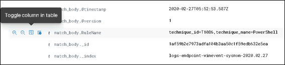 |
|----------|

Two techniques should come in to focus now. The first – “Signed Binary Proxy Proxy Execution” – is interesting. Note that these were not picked up because of the Signed Binary Execution, but because the port in use was TCP/4444, which is a common backport used by instructors.


| 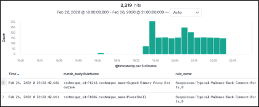 |
|----------|

The screenshot to the below has the “Suspicious Back Connect Ports” MITRE rule filtered. Under most circumstances, malware authors do not use TCP 4444 for communication channels. 

| 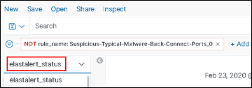 |
|----------|

![][NextStep]

![][Div1]

![Hunt Step Two][HuntStepTwo]
## Sysmon Stack
Continue the hunt!

![][Div2]

### Login to Member Server (WS01)
Connect via Remote Desktop to the Member Server (WS01).  
See Lab [L0200][L0200] for connection instructions.

![][Div2]

### Access Kibana on the (H)ELK SIEM
Using Chrome or Internet Explorer on Member Server, access the Kibana URI and login using the credentials below.
```plaintext
URL: https://10.10.98.20
Useranme: helk
Password: hunting
```

![][Div2]

### Sysmon Log Index
Filtering **“Suspicious Ports”** caused the alert for MSBuild to drop out of the ElastAlert results. Next, try the Sysmon log index to see if there are IoCs. Below, the log index was swapped to **logs-endpoint-winevent-sysmon-\*** and a spike in activity is apparent. 

The results pane seen to the below also allows an end user to draw a rectangle around a time window of interest. 

| 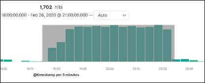 |
|----------|

Clicking on a single time column should present results like the following. The results pane below has RuleName, **dst\_ip\_addr**, and **process_name** toggled as columns. Sysmon appears to have caught both C2 beacons, shipped the logs to Elastic, which then mapped them to the appropriate MITRE Framework Techniques. 


| 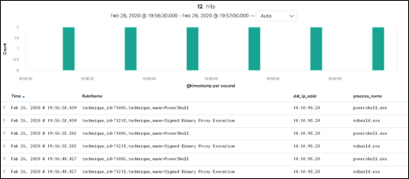 |
|----------|

Lets consider going off road and see what more we can find!

![][NextStep]

![][Div1]


![Hunt Step Two][HuntSafari]
## Off-Roading with C2 Frameworks 
Sometimes the hunt involves following leads that take you off-course, off-road, and into the weeds.  With strong (verbose) threat optics, you begin to see how adversarial tools interact with the systems they attack.  Some methodologies of hunts will require you to investigate and analyze what is happening in certain time periods were you know tool interaction exist.   


### Windows Events. 
Let's start in Kibana and work backward.   (Be sure to check the time in your query (Calendar Control in Kibana)
Select log index: Search stager.*


| 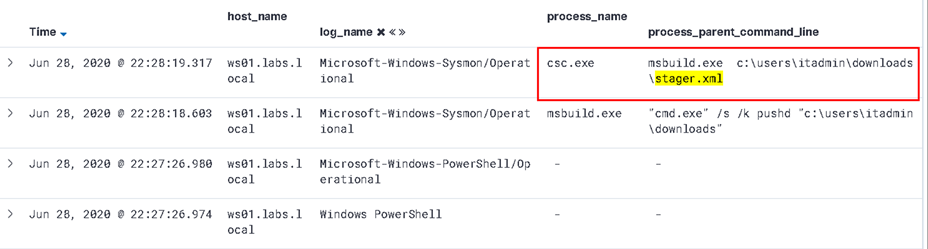 |
|----------|

We were able to catch the execution of the msbuild process.

![][Div2]

### Sysmon Logs

Let's go look at the sysmon logs. Why? 
* The sysmon logs will do a much better job of tracking network connections than standard Windows logs. 

| 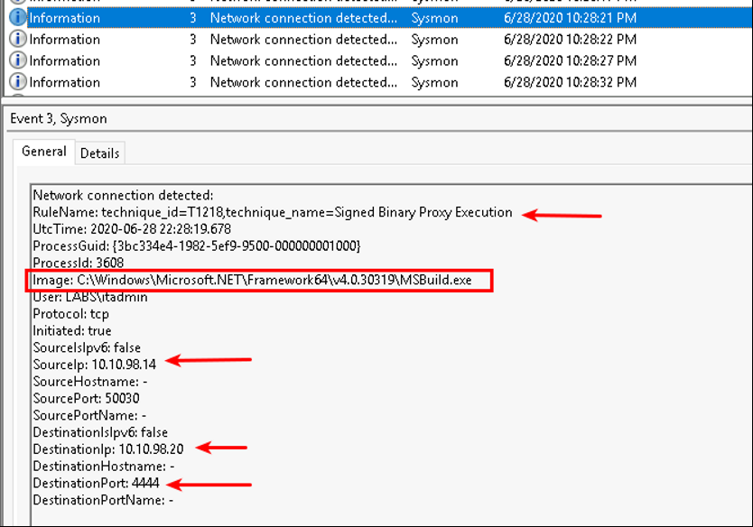 |
|----------|


Source and destination IP, destination port, actual MITRE technique mapped:
* **T1218 – Signed Binary Proxy Execution.**

![][Div2]
### Text Search MSBuild


Head back to Kibana and search for msbuild

![Hunt Search Term][HuntSearchTerm]
```plaintext
msbuild
```

A few of the column headers shown below add value to the search. Add what you feel helpful. The pattern looks like we may have found a beacon.

| 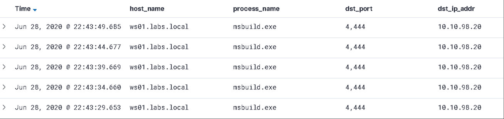 |
|----------|

![][Div2]


### Beacon Timing
Drilling down, we have what appears to be a beacon in logs.

| 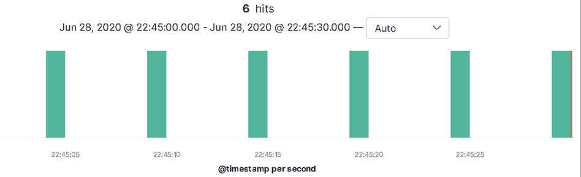 |
|----------|

![][Div2]
### More Safari
Another interesting search in Kibana looks like the following. It says "Show me the events where PowerShell made a network connection."  By browsing other logs in the same timeframe of the beacons, you find other possible indicators.

![Hunt Search Term][HuntSearchTerm]
```plaintext
powershell.exe and event_id: 3
```
 
 Which index do you think you should use for this query?  Try out a couple, did you find anything interesting?

You may find something like (once the C2 channel was established) demonstrated below. 
* This is a result of powershell making outbound connections (event\_id:3\_).
* In a typical environment, should Powershell be behaving such as this?

| 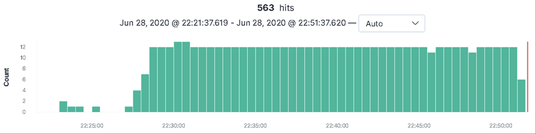 |
|----------|

![][Div2]
### Mitre ATT&CK Technique Mapping
Because the optics chain now includes active markup and processing during log ingestion, it is possible to leverae the pipeline's Mitre ATT&CK mapping feature.  You can search for specific technique's that have resulted from sysmon genreated logs.

* T1086 – PowerShell
* T1218 – Signed Binary Proxy Execution

Look at the log results below. The process_name and RuleName are document attributes listed as table columns.

| 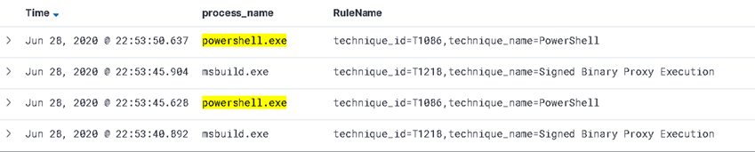 |
|----------|

* How is this helpful for a blue team?
* Do you think the red team knew this behavior could be tracked like this?

![][Div2]

### ElastAlert Index
Remember that ElastAlert is monitoring what is being added into Elastic.  It processes aggregate data in Helk and generates its own alerts based on its own signature criteria.

Change the log index to elastalert_status index.  


| 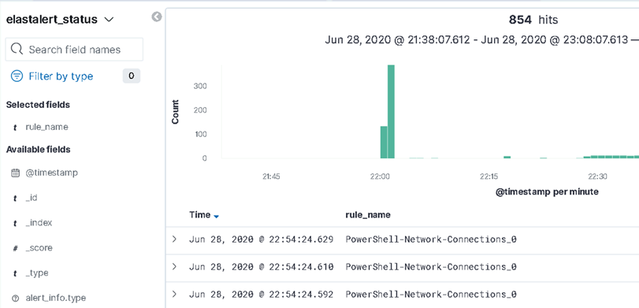 |
|----------|

Did ElastAlert alert of anything unusual?
* Remember ElastAlert is a method of grouping many logs together to make assumptions.
* When ElastAlert creates a document in Helk, it found something interesting that warrants review.


![][NextStep]

Once you have identified some potential IOC, we need to tear-down the C2 framework.

![][Div1]


![Step Three][StepThree] 
## Shutdown Malware Stagers
Lets tear down that C2 framework!  Once detection has been verified, close out both command terminals on the victim machine.

![][Div2]

### PowerShell Stager
Exit the Powershell Malware stager

* **CTRL + C** may work to close the PowerShell stager.

![Powershell Input][PowershellInput]

```plaintext
CTRL+C
```
![Powershell Output][PowershellOutput]
```plaintext
[*] Executing
sYJwhAelHQ CheckIn
        [-] 'System.Management.Automation.resources.dll' was required...
```
Next, lets look at closing the XML stager

![][Div2]

### XML Stager

The build process for the XML stager may not close with CTRL+C.  If the CTRL + C fails to halt the process, close the session window.  

![Powershell Input][PowershellInput]
```plaintext
CTRL+C
```
![Powershell Output][PowershellOutput]

```plaintext
[*] Executing
z8DiGrOcG3 CheckIn
Attempting to cancel the build...
Project "c:\Users\itadmin\Downloads\stager.xml" on node 1 (default targets).
c:\Users\heather.butler\Downloads\stager.xml(3,5): warning MSB4220: Waiting for the currently executing task "AXHzw" to
 cancel.
c:\Users\heather.butler\Downloads\stager.xml(3,5): warning MSB4220: Waiting for the currently executing task "AXHzw" to
 cancel.
c:\Users\heather.butler\Downloads\stager.xml(3,5): warning MSB4220: Waiting for the currently executing task "AXHzw" to
 cancel.
c:\Users\heather.butler\Downloads\stager.xml(3,5): warning MSB4220: Waiting for the currently executing task "AXHzw" to
 cancel
```
Lastly, lets look at the remaining Putty session Windows.

![][Div2]

### Putty Sessions
Ensure all sessions are closed out, including sessions running nested with "screen".  To do this, go to each putty terminal and use CTRL+C to return to a bash prompt.  Then use "Exit" to exit from the session.  If the putty window does not close, use "Exit" again (nested session).

![Bash Input][BashInput]


```plaintext
CTRL+C
Exit
CTRL+Z
```

![][Div2]

### Reboot MemberServer WS01
The closing of all the session windows should stop all Beacon traffic.  However, if this the malware did not exit, the continual beacons may obscure future attack and hunting efforts.  The malware stagers are not persistent, therefore, reboot the MemberServer WS01 to eliminate the possibility of recurring malware beacon attempts from the C2 Framework.

![Powershell Input][PowershellInput]

```powershell
Restart-Computer
```

After the system has rebooted, you are finished with this lab.


![][Div1]

![Lab Complete][LabComplete]


  [LabContents]:https://img.shields.io/badge/Lab-Contents-purple.svg?style=for-the-badge
  [LabAddendum]:https://img.shields.io/badge/Lab-Addendum-magenta.svg?style=for-the-badge
  [LabOverview]:https://img.shields.io/badge/Lab-Overview-darkblue.svg?style=for-the-badge
  [LabObjectives]:https://img.shields.io/badge/Lab-Objectives-darkblue.svg?style=for-the-badge
  [LabMethodology]:https://img.shields.io/badge/Lab-Methodology-darkblue.svg?style=for-the-badge
  [LabComplete]:https://img.shields.io/badge/Lab-Complete-red.svg?style=for-the-badge
  [NextStep]:https://img.shields.io/badge/Step%20Complete-Onward!-darkgreen.svg?style=flat-sware
  [PowershellInput]:https://img.shields.io/badge/Powershell-Input-green.svg?style=flat-sware
  [BashInput]:https://img.shields.io/badge/Bash-Input-green.svg?style=flat-sware
  [BashOutput]:https://img.shields.io/badge/Bash-Output-orange.svg?style=flat-sware
  [STInput]:https://img.shields.io/badge/SilentTrinity-Input-green.svg?style=flat-sware
  [STOutput]:https://img.shields.io/badge/SilentTrinity-Output-orange.svg?style=flat-sware
  [HuntSearchTerm]:https://img.shields.io/badge/Hunt-Search%20Term-blue.svg?style=flat-sware
  [PowershellOutput]:https://img.shields.io/badge/Powershell-Output-orange.svg?style=flat-sware
  [GuiNav]:https://img.shields.io/badge/GUI-Navigation-orange.svg?style=flat-sware
  [StepOne]:https://img.shields.io/badge/Step-One-blue.svg?style=for-the-badge
  [StepTwo]:https://img.shields.io/badge/Step-Two-blue.svg?style=for-the-badge
  [StepThree]:https://img.shields.io/badge/Step-Three-blue.svg?style=for-the-badge
  [StepFour]:https://img.shields.io/badge/Step-Four-blue.svg?style=for-the-badge
  [StepFive]:https://img.shields.io/badge/Step-Five-blue.svg?style=for-the-badge
  [StepSix]:https://img.shields.io/badge/Step-Six-blue.svg?style=for-the-badge
  [AttackStepOne]:https://img.shields.io/badge/Attack-Step%20One-red.svg?style=for-the-badge 
  [AttackStepTwo]:https://img.shields.io/badge/Attack-Step%20Two-red.svg?style=for-the-badge
  [AttackStepThree]:https://img.shields.io/badge/Attack-Step%20Three-red.svg?style=for-the-badge 
  [AttackStepFour]:https://img.shields.io/badge/Attack-Step%20Four-red.svg?style=for-the-badge
  [AttackStepFive]:https://img.shields.io/badge/Attack-Step%20Five-red.svg?style=for-the-badge
  [AttackStepSix]:https://img.shields.io/badge/Attack-Step%20Six-red.svg?style=for-the-badge
  [HuntSafari]:https://img.shields.io/badge/Safari-Kibana%20OffRoading-blue.svg?style=for-the-badge
  [HuntStepOne]:https://img.shields.io/badge/Hunt-Step%20One-blue.svg?style=for-the-badge
  [HuntStepTwo]:https://img.shields.io/badge/Hunt-Step%20Two-blue.svg?style=for-the-badge
  [HuntStepThree]:https://img.shields.io/badge/Hunt-Step%20Three-blue.svg?style=for-the-badge
  [HuntStepFour]:https://img.shields.io/badge/Hunt-Step%20Four-blue.svg?style=for-the-badge
  [APTStepOne]:https://img.shields.io/badge/APT-Step%20One-purple.svg?style=for-the-badge
  [PurpleTeam]:https://img.shields.io/badge/Team-Purple-purple.svg?style=for-the-badge
  [Div1]:../../docs/images/divider%201.png
  [Div2]:../../docs/images/divider%202.png
  [L0200]: ../L0200/
  [L0250]: ../L0250/
  [L0310]: ../L0310/
  [L0311]: ../L0311/
  [L0320]: ../L0320/
  [L0330]: ../L0330/
  [L0340]: ../L0340/
  [L0350]: ../L0350/
  [L1120]: ../L1120/
  [L1130]: ../L1130/
  [L1140]: ../L1140/
