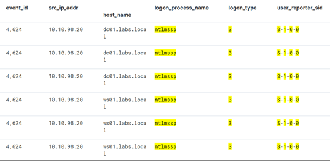
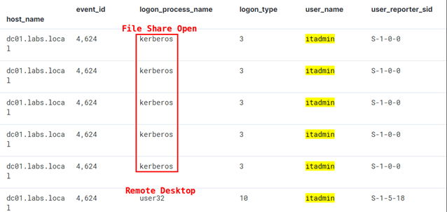
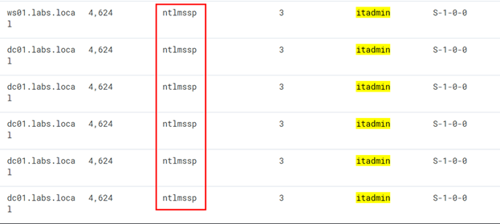
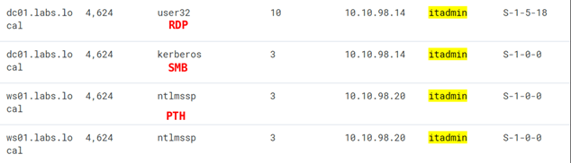
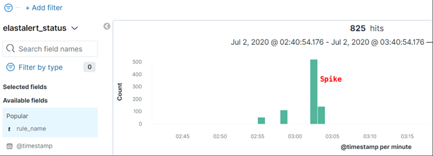
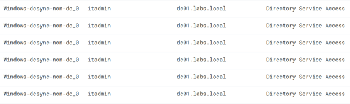
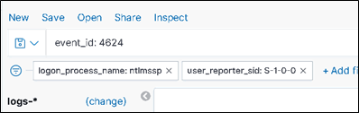
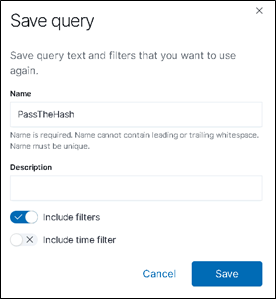
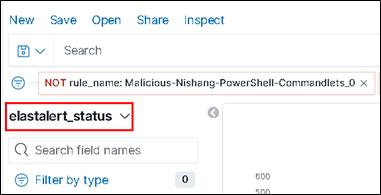
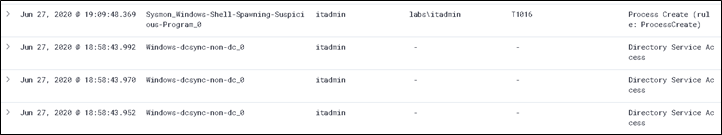

# APT0040.3-Blue Pass The Hash - CrackMacExec


![Lab Contents][LabContents]
<!-- Start Document Outline -->

* [EventID 4624](#eventid-4624)
	* [Login to Member Server (WS01)](#login-to-member-server-ws01)
	* [Access Kibana on the (H)ELK SIEM](#access-kibana-on-the-helk-siem)
	* [Begin the hunt:](#begin-the-hunt)
	* [More hunting](#more-hunting)
	* [Yet More Hunting Chaos](#yet-more-hunting-chaos)
* [ElastAlert](#elastalert)

<!-- End Document Outline -->
![][Div1]

![Lab Overview][LabOverview]

Using Kibana and ElastAlert, find IOC's for the PassTheHash attack


![][Div2]

![Lab Overview][LabObjectives]

By starting with a search during the time-frame and knowledge of event-ids, being hunting for evidence of a pass the hash attack.

![][Div2]

![Lab Overview][LabMethodology]

Utilize the threat-optics tool set and skills learned to define an IOC for pass-the-hash attacks.

![][Div1]

![Step One][HuntStepOne]
## EventID 4624
Lets kickoff the hunt!  Login to the WS01 system and access Kibana.

### Login to Member Server (WS01)
Connect via Remote Desktop to the Member Server (WS01).  
See Lab [L0200][L0200] for connection instructions.

### Access Kibana on the (H)ELK SIEM
Using Chrome or Internet Explorer on Member Server, access the Kibana URI and login using the credentials below.
```plaintext
URL: https://10.10.98.20
Username: helk
Password: hunting
```

![][Div2]

### Begin the hunt:
The first thing to look for is a logon event that includes the itadmin account.
Because the event was generated by the initial pass-the-hash attack, the search terms are apparent. 

![Hunt Search Term][HuntSearchTerm]

```plaintext
event_id: 4624 and itadmin
```
Catching this specific attack can be a challenge. To find this attack, toggle the following fields as columns. 

* logon_process_name
* src_ip_addr
* user_name
* user_reporter_sid 

Continue hunting; based on the results, this Elastic query and filter set produce reasonable results that tend to identify potential pass-the-hash attacks. 

![Hunt Search Term][HuntSearchTerm]

```plaintext
event_id: 4624 and logon_type: 3 and user_reporter_sid: "s-1-0-0" and logon_process_name: ntlmssp
```

| |
|----------|

Save this query for future use if desired.


![][Div2]
### More hunting

Let's investigate this further. As shown below, we can generate and review other authentication types and the combinations of reported items we see during authentication.

Start by adding columns of interest to the Kibana results table. 
* Shown below are event_id, logon_process_name, logon_type, user_name, and user_reporter_sid. 
* Two different authentication events generated the following logs: 
  * first (at the bottom), an RDP session to the DC was created and we see what appeared to be a normal user32 logon_type 10 (RemoteInteractive). 
  * The next set of authentication events were the result of the itadmin user browsing the C:\Labs share. These were reported as logon_type 3 (Network – usually file shares).

|  |
|----------|

Finally, to validate what we believe about the pass-the-hash, the following events were reported when authentication events originated from CrackMapExec. 

|  |
|----------|

We should be suspicious of the NTLM security service provider. As shown, when combined the network logon, and user_reporter_sid of S-1-0-0 (NULL / NOBODY), we have a potentially compromised account. Below, we add the src_ip field and prove that these are high fidelity queries to identify pass the hash attacks. 

|  |
|----------|

Next, let's investigate the ElastAlert_status index and see if any SIGMA alerts have triggered on this behavior. As we have learned, much of the malicious behavior performed on the network has generated spikes in events.

|  |
|----------|

Drilling down "into the spike" through time analysis and column cleanup, we should find something like the following, which is bad. 

|  |
|----------|

![][Div2]
### Yet More Hunting Chaos
What else can determine about how a Pass-The-Hash attack works.

![Hunt Search Term][HuntSearchTerm]

```plaintext
event_id: 4624
logon_process_name: ntlmssp
user_report_sid: S-1-0-0
logon_type: 3
```
|  |
|----------|

Save this query for future use if desired. When the query results appear similar, the lab is complete. 

|  |
|----------|


![][NextStep]

![][Div1]

![Step Two][HuntStepTwo]
## ElastAlert 
Switch the Kibana index source to elastalert_status. You might also note the applied filter (NOT rule_name: Rule). The Nishang PowerShell rule triggers often. 

|  |
|----------|

After filtering some of the noise, we can find interesting happenings in the ElastAlert_status index. As shown in the next screenshot, after dumping the domain’s NTDS, enough evidence was dumped via our logging optics in to ElasticSearch. ElastAlert does not act on live data ingests, rather on definable time windows against the Elastic database. Something you definitely want to catch is a DCSync from a non-DC.

|  |
|----------|

![][NextStep]

![][Div1]


![Lab Complete][LabComplete]


  [LabContents]:https://img.shields.io/badge/Lab-Contents-purple.svg?style=for-the-badge
  [LabAddendum]:https://img.shields.io/badge/Lab-Addendum-magenta.svg?style=for-the-badge
  [LabOverview]:https://img.shields.io/badge/Lab-Overview-darkblue.svg?style=for-the-badge
  [LabObjectives]:https://img.shields.io/badge/Lab-Objectives-darkblue.svg?style=for-the-badge
  [LabMethodology]:https://img.shields.io/badge/Lab-Methodology-darkblue.svg?style=for-the-badge
  [LabComplete]:https://img.shields.io/badge/Lab-Complete-red.svg?style=for-the-badge
  [NextStep]:https://img.shields.io/badge/Step%20Complete-Onward!-darkgreen.svg?style=flat-sware
  [PowershellInput]:https://img.shields.io/badge/Powershell-Input-green.svg?style=flat-sware
  [BashInput]:https://img.shields.io/badge/Bash-Input-green.svg?style=flat-sware
  [BashOutput]:https://img.shields.io/badge/Bash-Output-orange.svg?style=flat-sware
  [STInput]:https://img.shields.io/badge/SilentTrinity-Input-green.svg?style=flat-sware
  [STOutput]:https://img.shields.io/badge/SilentTrinity-Output-orange.svg?style=flat-sware
  [HuntIndex]:https://img.shields.io/badge/Hunt-Index%20Term-darkgreen.svg?style=flat-sware
  [HuntSearchTerm]:https://img.shields.io/badge/Hunt-Search%20Term-blue.svg?style=flat-sware
  [PowershellOutput]:https://img.shields.io/badge/Powershell-Output-orange.svg?style=flat-sware
  [GuiNav]:https://img.shields.io/badge/GUI-Navigation-orange.svg?style=flat-sware
  [StepOne]:https://img.shields.io/badge/Step-One-blue.svg?style=for-the-badge
  [StepTwo]:https://img.shields.io/badge/Step-Two-blue.svg?style=for-the-badge
  [StepThree]:https://img.shields.io/badge/Step-Three-blue.svg?style=for-the-badge
  [StepFour]:https://img.shields.io/badge/Step-Four-blue.svg?style=for-the-badge
  [StepFive]:https://img.shields.io/badge/Step-Five-blue.svg?style=for-the-badge
  [StepSix]:https://img.shields.io/badge/Step-Six-blue.svg?style=for-the-badge
  [AttackStepOne]:https://img.shields.io/badge/Attack-Step%20One-red.svg?style=for-the-badge 
  [AttackStepTwo]:https://img.shields.io/badge/Attack-Step%20Two-red.svg?style=for-the-badge
  [AttackStepThree]:https://img.shields.io/badge/Attack-Step%20Three-red.svg?style=for-the-badge 
  [AttackStepFour]:https://img.shields.io/badge/Attack-Step%20Four-red.svg?style=for-the-badge
  [AttackStepFive]:https://img.shields.io/badge/Attack-Step%20Five-red.svg?style=for-the-badge
  [AttackStepSix]:https://img.shields.io/badge/Attack-Step%20Six-red.svg?style=for-the-badge
  [HuntStepOne]:https://img.shields.io/badge/Hunt-Step%20One-blue.svg?style=for-the-badge
  [HuntStepTwo]:https://img.shields.io/badge/Hunt-Step%20Two-blue.svg?style=for-the-badge
  [HuntStepThree]:https://img.shields.io/badge/Hunt-Step%20Three-blue.svg?style=for-the-badge
  [HuntStepFour]:https://img.shields.io/badge/Hunt-Step%20Four-blue.svg?style=for-the-badge
  [APTStepOne]:https://img.shields.io/badge/APT-Step%20One-purple.svg?style=for-the-badge
  [PurpleTeam]:https://img.shields.io/badge/Team-Purple-purple.svg?style=for-the-badge
  [Div2]:../../docs/images/divider%202.png
  [Div1]:../../docs/images/divider%201.png
  [L0200]: ../L0200/
  [L0250]: ../L0250/
  [L0310]: ../L0310/
  [L0311]: ../L0311/
  [L0320]: ../L0320/
  [L0330]: ../L0330/
  [L0340]: ../L0340/
  [L0350]: ../L0350/
  [L1120]: ../L1120/
  [L1130]: ../L1130/
  [L1140]: ../L1140/